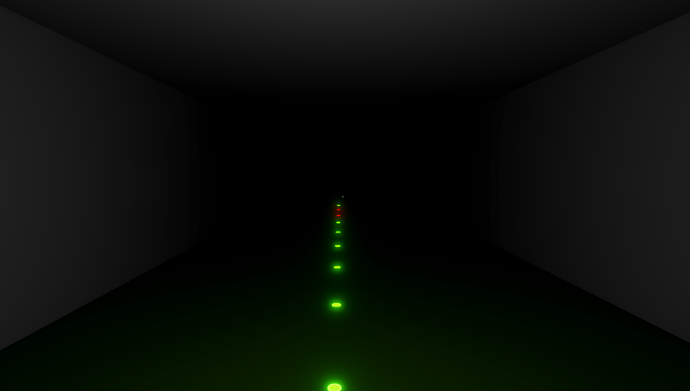
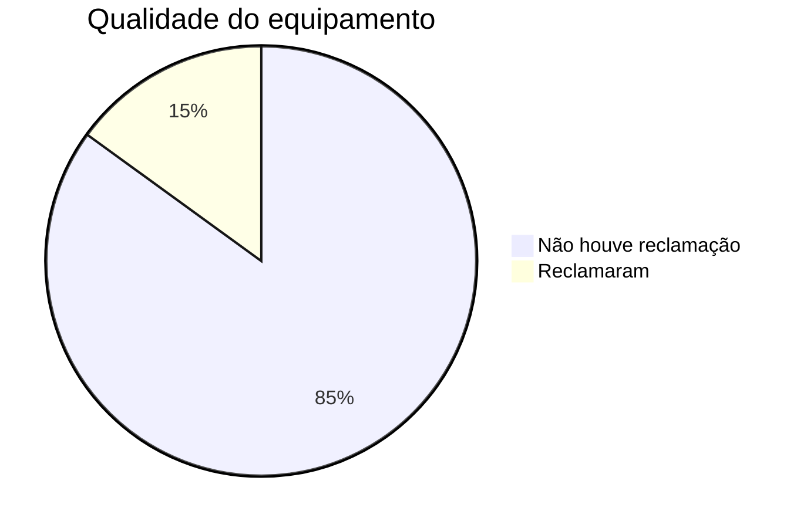

# Computação Gráfica: Projeto Final

## Used Git Repo: <https://github.com/ArturJMartins/CG_ProjetoFinal>

## Author

### Artur Martins a22304625

## Goal

The goal of this project is to build something that involves computer graphics.

## Description

### Decals

The project that I chose was to implement decals in Unity (level 3 difficulty). Decals in Unity can project specific decal materials onto other objects. A decal can wrap around geometry and interact with scene lighting. However, this feature has a limitation, it does not work on transparent surfaces.

### Techniques used

First I created a 3D Unity project with URP. Then at the Hierarchy, I created an empty GameObject and added a Unity component called URP Decal Projector. In order to create a specific decal material, I created a material first, then on the Shader tab, I selected Decal(shader graphs). In the Inputs I set the Normal Blend to 0, so that the transparent spot of the Base Map is not visible. I selected my Base Map with a circle outlined. Now that I got a decal material ready, I went to the GameObject with the URP Decal Projector and placed the decal material. Also in the pivot I changed the Z value to 0 to not have any offset. At last, I decided to add a emission color to the decal. To add emission to the decal projector, I clicked in Edit. Inside of the shader graph window, at the Graph Inspector I selected Affect Emission. On the Blackboard I added a Color property called ColorEmi. On the Internal Inspector I dragged the property that I created and dragged to the Emission and saved.
In the end, I made a prefab of this GameObject.

### How decals were implemented

I created a dark room, removing the directional light and the skybox, leaving only 1 point light in the beginning of the room. I created a `Player` script that shoots a decal prefab onto the rooms walls for testing. Then I decided to create one GameObject with the `MineDetecter` script that will move only forward, shooting the decals downwards creating a path with lights in the dark. With that I created a new decal material and placed 2 types of layers on the ground, so that this GameObject while shooting decals downwards could shoot a different decal material based on the layer type. If this was a game, the green emissive decal represents a safe path and the red emissive decal represents the mine spot.  

## Build Controllers

- Walk: W,A,S,D
- Shoot decal: Right mouse click
- Spawn mine detecter: Spacebar button
- Leave build: Escape button

## References

### Unity Documentation

- Decal: <https://docs.unity3d.com/6000.0/Documentation/Manual/urp/renderer-feature-decal.html>
- Graph Shader: <https://docs.unity3d.com/Packages/com.unity.shadergraph@17.0/manual/Create-Shader-Graph.html>

### Youtube

- Unity Shooting Decal: <https://www.youtube.com/watch?v=8dejKSbADqE&ab_channel=Brackeys>
- Unity Spray Decal: <https://www.youtube.com/watch?v=sDrNRsihePQ&ab_channel=BinaryLunar>
- Unity Shader Graph: <https://www.youtube.com/watch?v=M5t-pJWQwVM&ab_channel=Tannos2023>
- Unity Decal Tutorial: <https://www.youtube.com/watch?v=nqhkB8CG8pc&ab_channel=Unity>

